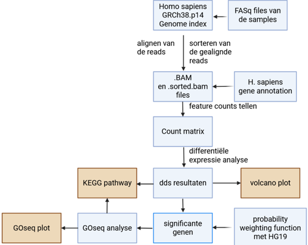
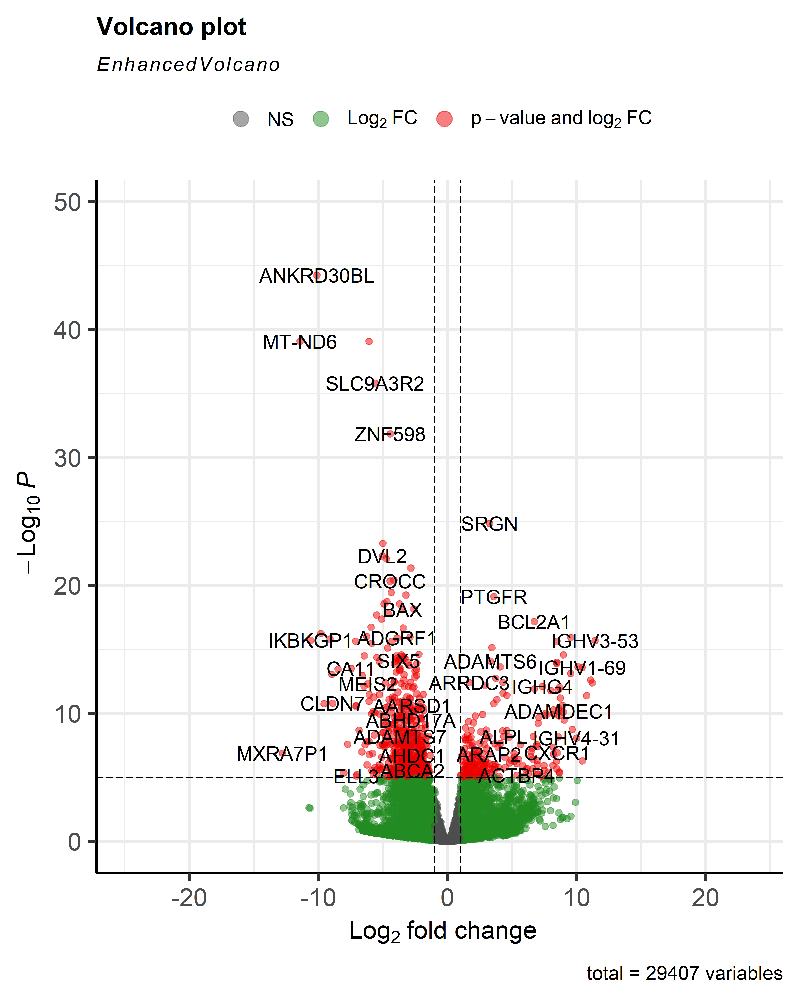
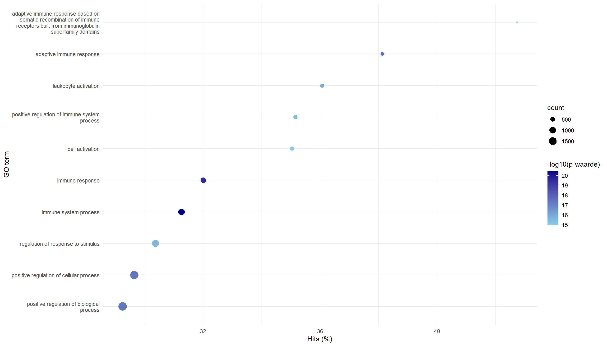
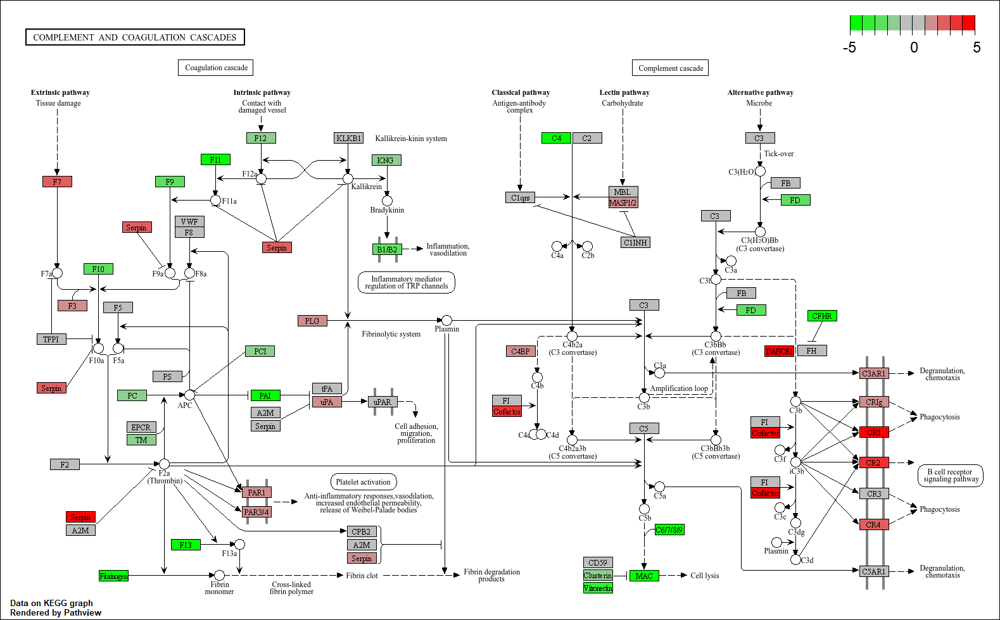

# Casus transcriptomics van personen met reumatoïde artritis
---
## Inleiding

Reumatoïde artritis (RA) is een chronische auto-immuunziekte die wordt gekenmerkt door aanhoudende ontsteking van de gewrichten, wat kan leiden tot pijn, functieverlies en gewrichtsschade. De ziekte wordt gekenmerkt door een ontregelde immuunrespons. Hoewel de precieze oorzaak van RA nog niet volledig bekend is, is het duidelijk dat genetische en omgevingsfactoren bijdragen aan het ontstaan van de ziekte (McInnes & Schett, 2011).

In dit project wordt een RNA-seq dataset van vier RA-patiënten en vier gezonde controles geanalyseerd met behulp van een differentiële expressieanalyse, KEGG analyse en een GO enrichment op gealignde en gesorteerde samples. Door deze analyses kunnen genen geïdentificeerd worden die significant anders tot expressie komen bij RA, wat inzicht geeft in ziekte-geassocieerde processen en kan bijdragen aan de ontwikkeling van gerichte therapieën (Smolen et al., 2016).

De volgende onderzoeksvragen zijn opgesteld.
*  Welke genen hebben een significant verschil in expressie bij mensen met Reuma?
* Bij welke biologische processen zijn deze genen betrokken? 
* Welke pathways worden beinvloed door de verschillen in gen expressie?

---
## Methode
De RNA-seq data-analyse werd uitgevoerd op monsters van vier personen met reuma en vier gezonde personen in R versie 4.4.0. Er is een referentie-index gebouwd op basis van het GRCh38.p14 genoom van Homo sapiens verkregen via NCBI. Hierbij werd gebruikgemaakt van het buildindex()-commando uit het Rsubread-pakket (Liao et al., 2019). De ruwe FASTQ-bestanden werden gealigned met behulp van de align() functie, ook uit Rsubread. De resulterende BAM-bestanden werden gesorteerd en geïndexeerd met het Rsamtools-pakket (Morgan et al., 2023).

Vervolgens werd een count-matrix gegenereerd op basis van een bijbehorend GTF-bestand verkregen via Ensembl. De differentiële expressieanalyse werd uitgevoerd met het DESeq2-pakket (Love et al., 2014). Genen met een aangepaste p-waarde kleiner dan 0.05 werden beschouwd als significant.

Voor de gene ontology (GO) verrijking werd goseq (Young et al., 2010) gebruikt, in combinatie met de annotatiepakketten org.Hs.eg.db en GO.db, om biologische processen (BP) van de differentieel tot expressie komende genen te identificeren. Significante termen werden gevisualiseerd met ggplot2.

Tot slot werd pathway-analyse uitgevoerd met pathview (Luo & Brouwer, 2013), gericht op de KEGG-pathway “Toll-like receptor signaling” (hsa04610), die is bepaald met de GO resultaten.

*Figuur 1: Flowschema van de complete RNA-seq data analyse.*

---
## Resultaten
### Genexpressie
om de genexpressie te berekenen is een differentiële expressie analyse uitgevoerd op de count matrix. Hiermee wordt per gen de Log2 fold change berekend met bijbehorende significantie. In figuur 2 zijn de resultaten hiervan in een Volcano plot weergegeven.

*Figuur 2: Volcano plot van differentiële expressie analyse waarbij monsters van personen met RA zijn vergeleken met deze van gezonde personen. Log2 fold change is uitgezet tegen significantie. Genen in rood zijn significant (padj < 0.05).*

De volcano plot laat veel genen zien met een verschil in genexpressie tussen personen met RA en gezonde personen, Zowel positief als negatief.

### Gene ontology enrichment
Om inzicht te krijgen in de biologische processen waarbij de significante genen het meest bij betrokken zijn is een gene ontology (GO) enrichment analyse uitgevoerd. de meest voorkomende termen zijn in figuur 3 weergegeven 

*Figuur 3: Gene Ontology enrichment analyse van de gevonden significante genen. GO termen die het vaakst voor kwamen zijn geplot met Hits (%), count en significantie (-log10 p-waarde)*

In de GO analyse komen voornamelijk termen naar voren die te maken hebben met het immuunsysteem en de immuunreactie. Bijv. de activering van witte bloedcellen.

### Complement and coagulation cascades pathway

De KEGG pathway van hsa04610 (Complement and coagulation Cascades) is weergegeven in figuur 4, hiermee kan inzicht worden gekregen in hoe RA effect heeft op de regulatie van dit biologisch process.

*Figuur 4: KEGG pathway van Complement and Coagulation Cascades (hsa04610) met differentiële genexpressie tussen RA en controle. Genen zijn ingekleurd op basis van log2-fold change (rood: opgereguleerd, groen: neergereguleerd).*

De pathway laat zien dat verschillende componenten van zowel het coagulatiepad (links) als het complementpad (rechts) anders tot expressie komen in RA. Dit wijst op een mogelijk verband tussen verstoring van deze cascades en de ontstekingsprocessen bij RA.

---
## conclusie
Op basis van de RNA-seq data-analyse van personen met reumatoïde artritis (RA) vergeleken met gezonde personen blijkt dat RA een verband heeft met aanzienlijke veranderingen in genexpressie, met name in immuungerelateerde genen. De differentiële expressieanalyse identificeerde veel significante genen. De GO enrichment analyse liet zien dat de meeste betrokken zijn bij immuunprocessen.

De KEGG-pathwayanalyse van de Complement and Coagulation Cascades (hsa04610) liet zien dat genen binnen zowel het complement- als het stollingssysteem significant op- of neergereguleerd zijn bij RA. Dit ondersteunt het idee dat verstoring van deze cascades een rol speelt in de pathofysiologie van RA (Ricklin et al., 2016).

